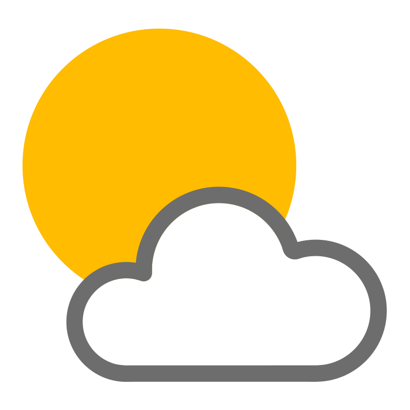

# WeatherApp

WeatherApp es una aplicación de pronóstico del tiempo que utiliza la API de clima de [WeatherAPI](https://www.weatherapi.com/) para proporcionar información sobre el clima actual y pronósticos para la ubicación del usuario. La aplicación está desarrollada siguiendo los principios de arquitectura MVVM, utilizando Retrofit para realizar solicitudes a la API, implementando Clean Architecture y siguiendo los principios de SOLID. Además, la aplicación almacena los datos en una base de datos local utilizando Room y utiliza el GPS del dispositivo para determinar la ubicación del usuario y mostrar el clima correspondiente.

## Configuración de la API

La API de WeatherAPI requiere una clave de API para su acceso. Asegúrate de agregar tu clave de API en el archivo `app/src/main/res/values/strings.xml` de la siguiente manera:

```xml
<string name="api_key">tu_clave_de_api_aqui</string>
<string name="default_language">tu_lang_aqui</string>
<integer name="default_days">dias_que_quieres_cargar</integer>
```

Reemplaza `"tu_clave_de_api_aqui"` con la clave de API que obtuviste al registrarte en WeatherAPI.
Reemplaza `"tu_lang_aqui"` con el lenguage en que quieres recibir la informacion del API.
Reemplaza `"dias_que_quieres_cargar"` con la cantidad de dias que quieres obtener a partir del dia actual.

## Características

- Muestra el clima actual y el pronóstico para la ubicación del usuario.
- Permite buscar pronósticos para otras ubicaciones.
- Guarda el historial de búsquedas.

## Tecnologías utilizadas

- Kotlin
- Android Architecture Components
    - ViewModel
    - LiveData
    - Room
- Retrofit
- Google Play Services (para el uso del GPS)
- Clean Architecture
- Principios SOLID

## Cómo utilizar la aplicación

1. Clona el repositorio:

```bash
git clone https://github.com/Kronos1993/WeatherApp.git
```

2. Abre el proyecto en Android Studio.

3. Configura tu API Key de la API de clima en el archivo `app/src/main/res/values/api.xml`, como se mencionó anteriormente.

4. Ejecuta la aplicación en un emulador o dispositivo Android.

5. La aplicación solicitará permiso para acceder a la ubicación y almacenamiento del dispositivo. Asegúrate de otorgar estos permisos para obtener información precisa del clima y poder almacenar las busquedas en base de datos.

6. La aplicación mostrará el clima actual y podrás buscar pronósticos para otras ubicaciones.

## Estructura del proyecto

El proyecto sigue una estructura organizada siguiendo los principios de Clean Architecture. En el directorio `data` encontrarás las fuentes de datos, en `domain` la lógica de negocio y en `app` las clases encargadas de la interfaz de usuario.

## Contribuciones

Si deseas contribuir a este proyecto, siéntete libre de crear una bifurcación (fork) y enviar una solicitud de extracción (pull request) con tus mejoras. También puedes informar sobre problemas o errores a través de las Issues.

## Licencia

Este proyecto está bajo la licencia MIT. Consulta el archivo [LICENSE](LICENSE) para obtener más información.

## Contacto

Si tienes alguna pregunta o inquietud, no dudes en ponerte en contacto con nosotros en mguerral1993@gmail.com .